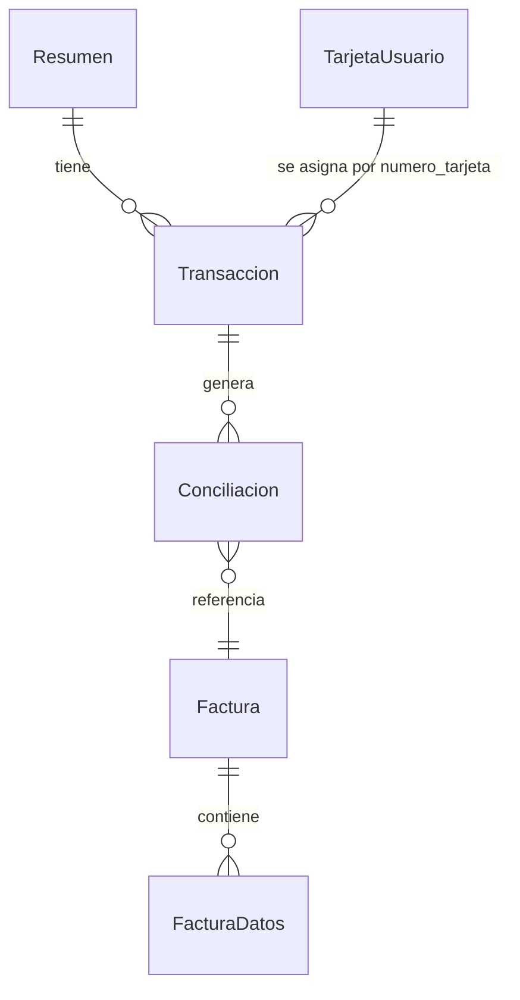

# Reporte Facturas

Concilia resúmenes de tarjeta de crédito (PDF) contra facturas almacenadas en Google Drive, usando inteligencia artificial vía OpenRouter.

## ¿Qué resuelve?

Si trabajás con tarjetas corporativas en Argentina (AMEX, VISA, Mastercard), sabés el trabajo manual que implica cotejar cada movimiento del resumen contra su factura correspondiente. Esta app automatiza todo el proceso:

1. Subís el PDF del resumen → la app extrae cada transacción con IA por visión.
2. Conectás Google Drive → navegás a la carpeta donde están las facturas.
3. La app descarga y extrae los datos de cada factura (monto, emisor, CUIT, número, fecha).
4. **Concilia automáticamente**: matchea cada transacción con su factura usando reglas de código + IA.
5. Descargás Excel o PDF con los resultados, o generás borradores de email para pedir las facturas faltantes.

## Stack

| Capa | Tecnología |
|------|-----------|
| Framework | FastAPI 0.115 (Python async) |
| Server | Uvicorn |
| Base de datos | SQLite (`aiosqlite`) — compatible con PostgreSQL (`asyncpg`) |
| ORM | SQLAlchemy 2.0 (async) |
| Frontend | Jinja2 + Vanilla JS + Tailwind CSS (CDN) |
| IA / LLM | OpenRouter (primario), Anthropic, OpenAI |
| Google Drive | API v3 (OAuth2) |
| PDFs | `pdf2image` + `markitdown` + `pdfplumber` |
| Reportes | `openpyxl` (Excel), `fpdf2` (PDF) |
| Config | `pydantic-settings` (`.env`) |

## Requisitos previos

- Python 3.11+
- [Poppler](https://poppler.freedesktop.org/) (requerido por `pdf2image` para convertir PDFs a imágenes)
  - Ubuntu/Debian: `sudo apt install poppler-utils`
  - macOS: `brew install poppler`
  - Windows: descargar de http://blog.alivate.com.au/poppler-windows/
- Una cuenta en [OpenRouter](https://openrouter.ai/) con crédito
- Un proyecto en [Google Cloud Console](https://console.cloud.google.com/) con API de Drive habilitada y credenciales OAuth2

## Levantar local

```bash
# Clonar
git clone https://github.com/JPabloLazo/reporte-facturas.git
cd reporte-facturas

# Entorno virtual
python -m venv .venv
source .venv/bin/activate  # o .venv\Scripts\activate en Windows

# Dependencias
pip install -r requirements.txt

# Config
cp .env.example .env
# Editar .env con tus credenciales:
#   OPENROUTER_API_KEY=sk-or-v1-...
#   GOOGLE_CLIENT_ID=...apps.googleusercontent.com
#   GOOGLE_CLIENT_SECRET=GOCSPX-...
#   SECRET_KEY= (cambiar en producción)

# Arrancar
uvicorn app.main:app --reload
# → http://localhost:8000
```

## Estructura del proyecto

```
app/
├── main.py               # FastAPI app, lifespan, middleware
├── config.py             # Settings + IA_PROFILES
├── database.py           # Async engine + session
├── models.py             # SQLAlchemy ORM: Resumen, Transaccion, Conciliacion, Factura, etc.
├── dependencies.py       # get_db dependency
├── routers/
│   ├── upload.py         # POST /api/upload — subir PDF, extraer transacciones
│   ├── process.py        # POST /api/process — conciliar, preview, save
│   ├── reports.py        # GET /api/reports — Excel, PDF, historial, emails
│   ├── drive.py          # GET /api/drive — OAuth, browse, files
│   └── config.py         # GET/PUT /api/config — settings + cards
├── services/
│   ├── pdf_parser.py     # ResumenParser — LLM vision multi-página
│   ├── llm_router.py     # LLMRouter — cliente unificado OpenRouter
│   ├── llm_extractor.py  # InvoiceExtractor — extrae datos de facturas
│   ├── markitdown_extractor.py
│   ├── conciliador.py    # Conciliador — matching 2 fases (code + LLM)
│   ├── drive_service.py  # GoogleDriveService — Drive API wrapper
│   ├── preview_service.py
│   ├── email_generator.py
│   ├── excel_generator.py
│   └── pdf_generator.py
├── templates/
│   ├── base.html
│   ├── index.html
│   └── config.html
└── static/
    └── js/
        └── main.js        # ~1700 líneas de vanilla JS
```

## Flujo principal

### 1. Upload de resumen
```
PDF → pdf2image (DPI 100, JPEG quality 50, max 15 páginas)
  → LLM vision extrae transacciones
    → integridad: cuenta páginas antes, si difiere → modal de retry
      → Resumen + Transacciones guardados en DB
```

### 2. Conexión Google Drive
```
OAuth2 (per-session, cookie uuid)
  → navegación de carpetas con breadcrumb
    → selección de carpeta de facturas
```

### 3. Extracción de facturas
```
PDF de Drive → markitdown (texto)
  → si texto < 50 chars → fallback vision (últimas 3 páginas, DPI 150)
    → LLM extrae: monto_total, emisor, CUIT, tipo_factura, nro_factura, fecha
```

### 4. Conciliación
```
Fase 1 (CODE):
  Monto ±1% (normal) o monto*cantidad_cuotas ±5% (cuotas)
  + fecha ±3 días
  → 1 match = confianza 0.95

Fase 2 (LLM):
  Si 0 o múltiples candidatos → LLM elige
  → confianza 0.85
```

### 5. Resultados
```
MATCHED (verde) / UNMATCHED (rojo)
  → Excel filtrable (todos / solo match / solo sin factura)
    → PDF de transacciones
      → borradores de email por titular de tarjeta
```

## Modelo de datos



| Entidad | Descripción |
|---------|-------------|
| `Resumen` | Resumen de tarjeta procesado (tipo: AMEX/VISA, período) |
| `Transaccion` | Movimiento individual del resumen (fecha, monto, descripción, cuotas) |
| `Conciliacion` | Resultado del matching (MATCHED/UNMATCHED, confianza, método) |
| `Factura` | Factura descargada de Drive (archivo, raw text) |
| `FacturaDatos` | Datos estructurados extraídos de la factura |
| `TarjetaUsuario` | Mapeo de último 4 dígitos → responsable (nombre, email) |
| `DriveSession` | Token OAuth por sesión de navegador |
| `Setting` | Configuración runtime (perfil IA, etc.) |

## Configuración de IA

La app tiene 4 perfiles de IA configurables desde la UI:

| Perfil | Extracción | Visión | Conciliación | Emails |
|--------|-----------|--------|-------------|--------|
| ⚡ Rápido | Claude Sonnet 4 | GPT-4o | Claude Sonnet 4 | Claude 3.5 Haiku |
| ⭐ Optimizado (default) | DeepSeek V3 (0324) | GPT-4o mini | DeepSeek V3 | GPT-4o mini |
| 🐢 Lento | DeepSeek V3.2 | Gemini 2.0 Flash Lite | DeepSeek V3.2 | Llama 3.1 8B |
| 🆓 Gratis (test) | GPT-OSS 120B | Gemma 4 31B | DeepSeek V4 Flash | Llama 3.3 70B |

## Ambiente

Variables de entorno (`.env`):

```env
OPENROUTER_API_KEY=sk-or-v1-...       # Requerido
GOOGLE_CLIENT_ID=...apps.googleusercontent.com  # Requerido para Drive
GOOGLE_CLIENT_SECRET=GOCSPX-...       # Requerido para Drive
SECRET_KEY=change-me-in-production    # Session security
DATABASE_URL=sqlite+aiosqlite:///./data/reporte_facturas.db
UPLOAD_DIR=./uploads
```

## Deploy en Render

La app incluye `render.yaml` para deploy automático en Render (free plan):

```yaml
buildCommand: pip install -r requirements.txt
startCommand: python -m uvicorn app.main:app --host 0.0.0.0 --port $PORT
```

Las variables de entorno sensibles (`GOOGLE_CLIENT_ID`, `GOOGLE_CLIENT_SECRET`, `OPENROUTER_API_KEY`, `SECRET_KEY`) se configuran desde el dashboard de Render.

**⚠️ Limitación:** El plan free de Render usa disco efímero. SQLite se pierde al reiniciar. Para producción, se recomienda PostgreSQL (el driver `asyncpg` ya está en requirements).

## Decisiones técnicas clave

- **Visión sobre pdfplumber**: Los resúmenes bancarios argentinos suelen ser PDFs imagen. Se abandonó pdfplumber como método principal en favor de LLM vision.
- **markitdown con fallback visión**: Para facturas, primero se intenta conversión a texto (barato/rápido). Si el texto es muy corto (<50 chars), se cae a visión.
- **OpenRouter como gateway principal**: Unifica API de Anthropic, OpenAI, DeepSeek, Google, etc. bajo un mismo token y formato.
- **Sesiones aisladas por cookie**: Cada sesión de navegador tiene su propio token de Drive. Múltiples usuarios pueden usar el mismo deploy sin compartir credenciales.
- **Integridad de transacciones**: Antes de extraer, el LLM cuenta transacciones por página. Si el conteo final difiere del esperado, la UI muestra un modal para retry/adición manual/continuar.
- **Savepoints por factura**: En `save_preview_facturas`, cada factura se guarda en un `begin_nested()` (savepoint) para que una factura inválida no arruine el lote completo.

## API Endpoints

| Método | Endpoint | Descripción |
|--------|----------|-------------|
| POST | `/api/upload` | Subir resumen PDF |
| POST | `/api/process/process` | Ejecutar conciliación |
| POST | `/api/process/preview` | Previsualizar facturas |
| POST | `/api/process/save` | Guardar facturas preview |
| GET | `/api/reports/{id}` | Detalle de resumen |
| GET | `/api/reports/{id}/excel` | Excel de resultados |
| GET | `/api/reports/{id}/transactions/excel` | Excel de transacciones |
| GET | `/api/reports/{id}/transactions/pdf` | PDF de transacciones |
| POST | `/api/reports/{id}/email/preview` | Borradores de email |
| GET | `/api/reports/historial` | Lista de historial |
| DELETE | `/api/reports/historial/{id}` | Eliminar resumen |
| GET | `/api/drive/auth/google` | Iniciar OAuth Drive |
| GET | `/api/drive/auth/callback` | Callback OAuth |
| GET | `/api/drive/auth/check` | Estado de conexión |
| POST | `/api/drive/auth/disconnect` | Desconectar Drive |
| GET | `/api/drive/browse` | Navegador de carpetas |
| GET | `/api/drive/files` | Archivos en carpeta |
| GET | `/api/config` | Config + cards |
| PUT | `/api/config` | Guardar config |

## Licencia

Uso interno.
