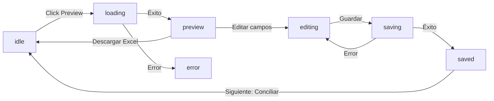

# Design: Vista Previa Editable de Facturas

## Technical Approach

Pipeline asíncrono de 3 pasos desacoplados: `preview` (extracción + preview editable) → `save` (persistencia) → `excel` (descarga). El `preview` es stateless (no escribe DB); el `save` persiste los datos corregidos. El frontend maneja la UI como máquina de estados.

## Architecture Decisions

### Decision: Preview como endpoint async sin background task

**Choice**: `POST /preview` síncrono con timeout de 120s, procesando facturas en paralelo con `asyncio.gather`.
**Alternatives**: Background task con polling, WebSocket, SSE.
**Rationale**: El preview es opcional y no bloqueante; el usuario lo dispara manualmente. Simplifica el estado del frontend (sin cola de tareas). Si timeout excede, se muestra error parcial con las facturas ya procesadas.

### Decision: Pipeline de extracción con 3 niveles (extensión → MarkItDown → LLM vision)

**Choice**: Se revisa la extensión del archivo primero. Si es imagen (jpg, png, jpeg, webp, gif, bmp) → LLM visión directo. Si es PDF → MarkItDown primero. Si MarkItDown devuelve < 50 caracteres → pdf2image → LLM visión.
**Alternatives**: Siempre usar LLM vision, siempre usar MarkItDown, solo revisar contenido.
**Rationale**: Los archivos de imagen no se pueden procesar con MarkItDown (no es conversor de imágenes). Intentarlo sería perder tiempo. Vision directo para imágenes. Para PDFs, MarkItDown es barato y rápido (~1s), vision es caro y lento (~10-20s), solo se usa como fallback para PDFs escaneados.

### Decision: Preview NO persiste en DB (stateless)

**Choice**: `POST /preview` devuelve JSON con datos extraídos sin guardar. Solo `POST /save` escribe en Factura + FacturaDatos.
**Alternatives**: Preview escribe en DB con flag `draft=True`.
**Rationale**: Simplifica el modelo, evita datos huérfanos, la preview se puede regenerar. El usuario vuelve a hacer preview si recarga.

## Data Flow

```
Usuario → [Selecciona carpeta Drive] → Click "Vista previa"
    │
    ▼
POST /api/process/preview
    │
    ▼
[GoogleDriveService.download_file()] por cada archivo (PDF + imágenes)
    │
    ▼ (paralelo, asyncio.gather)
┌─────────────────────────────────────┐
│ ¿Extensión?                          │
│   ├─ jpg/png/jpeg/webp/gif/bmp      │
│   │   → pdf2image → LLM vision       │
│   │   → InvoiceExtractor (LLM)       │
│   │   → devuelve dict con raw_text   │
│   │                                  │
│   └─ pdf                             │
│       → MarkitdownExtractor.convert()│
│         ├─ texto >= 50 chars         │
│         │   → InvoiceExtractor (LLM) │
│         │   → devuelve dict          │
│         │                            │
│         └─ texto < 50 chars          │
│             → pdf2image → LLM vision │
│             → InvoiceExtractor (LLM) │
└─────────────────────────────────────┘
    │
    ▼
Response: { facturas: [{ drive_file_id, name, raw_text, datos: {...} }] }
    │
    ▼
[JSON editable en frontend]
    │
    ├─ Click "Guardar y continuar" → POST /api/process/save
    │                                   → crea Factura + FacturaDatos en DB
    │                                   → redirige a conciliación
    │
    └─ Click "Descargar Excel" → GET /api/process/preview/excel
                                  → genera Excel con raw_text de MarkItDown
```

## Endpoints

### `POST /api/process/preview`

**Request body**:
```json
{
  "session_id": "uuid",
  "folder_id": "google-drive-folder-id",
  "file_ids": ["id1", "id2"]
}
```

**Response (200)**:
```json
{
  "facturas": [
    {
      "drive_file_id": "id1",
      "drive_file_name": "factura.pdf",
      "file_extension": "pdf",
      "extraction_method": "markitdown" | "vision" | "vision_fallback",
      "raw_text": "markdown completo",
      "datos": {
        "monto_total": 1500.00,
        "subtotal": 1350.00,
        "tipo_factura": "A",
        "fecha": "2026-01-15",
        "vencimiento": "2026-02-04",
        "emisor": "Empresa SA",
        "cuit_emisor": "30-12345678-9",
        "moneda": "ARS",
        "numero_factura": "F001-123",
        "cuota_numero": null
      },
      "error": null
    }
  ],
  "total": 1,
  "errores": 0,
  "partial": false
}
```

**Errores por factura** (no bloqueante):
```json
{
  "drive_file_id": "id2",
  "error": "No se pudo extraer datos de esta factura"
}
```

**Timeout**: 120s. Si se excede, se devuelve `{ "partial": true, "facturas": [...las que ya terminaron...], "timeout": true }`.

### `POST /api/process/save`

**Request body**:
```json
{
  "session_id": "uuid",
  "resumen_id": 42,
  "facturas": [
    {
      "drive_file_id": "id1",
      "drive_file_name": "factura.pdf",
      "raw_text": "markdown...",
      "datos": {
        "monto_total": 1500.00,
        "subtotal": 1350.00,
        "tipo_factura": "A",
        "fecha": "2026-01-15",
        "vencimiento": "2026-02-04",
        "emisor": "Empresa SA",
        "cuit_emisor": "30-12345678-9",
        "moneda": "ARS",
        "numero_factura": "F001-123",
        "cuota_numero": 1
      }
    }
  ]
}
```

**Response (200)**: `{ "saved": 3, "errores": 0, "factura_ids": [1, 2, 3] }`

**Validaciones**: monto_total numérico, cuota_numero entero opcional, fecha formato YYYY-MM-DD, emisor no vacío.

### `GET /api/process/preview/excel`

**Query params**: `?session_id=...&folder_id=...`
**Response**: `application/vnd.openxmlformats-officedocument.spreadsheetml.sheet`
**Contenido**: Columnas: Archivo, Método, Emisor, CUIT, Fecha, Vencimiento, Monto, Subtotal, Moneda, Tipo, N° Factura, Cuota N°, Texto extraído.

## Lógica de Extracción (pipeline)

```
Archivo → ¿Extensión?
  ├─ jpg/png/jpeg/webp/gif/bmp →
  │     pdf2image → PIL Image → base64 JPEG
  │     → LLMRouter.extract_with_vision() → JSON
  │     → extraction_method: "vision"
  │
  └─ pdf →
        MarkItDown → texto_md
        ├─ si len(texto_md) >= 50 →
        │     InvoiceExtractor(texto_md, llm) → JSON
        │     → extraction_method: "markitdown"
        │
        └─ si len(texto_md) < 50  →
              pdf2image → PIL Image → base64 JPEG
              → LLMRouter.extract_with_vision() → JSON
              → extraction_method: "vision_fallback"
```

**Detectar tipo de archivo**: Se usa la extensión del nombre (`file_name.lower().endswith(('.jpg', '.jpeg', '.png', '.webp', '.gif', '.bmp'))`). Si es imagen → LLM visión directo. Si es PDF → MarkItDown con fallback a visión. Actualmente Drive lista solo PDFs — se debe ampliar el filtro en `POST /preview` para incluir imágenes también.

**Detectar PDF imagen**: MarkItDown devuelve texto vacío o irrelevante (<50 chars, sin números). No hay metadata confiable — se usa heurística simple: si MarkItDown output < 50 caracteres imprimibles.

**Manejo de errores por factura**: Cada factura se procesa en un bloque try/except dentro del gather. Si falla, se incluye `"error": "mensaje"` en el item. No se detiene el procesamiento de las demás.

## Modelo — Cambios a FacturaDatos

Agregar a `app/models.py:87`:

```python
class FacturaDatos(Base):
    # ...existing fields...
    cuota_numero = Column(Integer, nullable=True, default=None)
```

**Impacto en Conciliador**: Ya existe `getattr(fd, 'cuota_numero', None)` en la línea 138 de `conciliador.py`. Con el campo real, se elimina el `getattr` y se accede directamente a `fd.cuota_numero`.

## Frontend

### Estados de UI (máquina de estados)



### Componentes

- **PreviewButton**: Dispara `POST /preview`, muestra spinner durante loading
- **EditableTable**: Tabla con inputs editables para cada campo. Cada fila = una factura. Validación inline (monto tiene que ser número, fecha formato correcto).
- **ActionBar**: Botones "Guardar y continuar" + "Descargar Excel". El primero habilita solo si todos los campos requeridos están completos.

### Integración con el flujo existente

Se agrega un botón "Vista previa" en la UI de selección de carpeta (junto a "Procesar conciliación"). Al hacer preview, se muestra la tabla editable en un nuevo panel. "Guardar y continuar" persiste y dispara conciliación (reusa el `POST /process` existente con `carpeta_drive_id`).

## Archivos a crear/modificar

| Archivo | Acción | Descripción |
|---------|--------|-------------|
| `app/routers/process.py` | Modificar | Agregar `POST /preview`, `POST /save`, `GET /preview/excel` |
| `app/services/preview_service.py` | Crear | Lógica de extracción: Drive → MarkItDown → vision fallback → InvoiceExtractor |
| `app/models.py` | Modificar | Agregar `cuota_numero` a `FacturaDatos` |
| `app/services/conciliador.py` | Modificar | Cambiar `getattr(fd, 'cuota_numero', None)` → `fd.cuota_numero` (línea 138) |
| `app/services/markitdown_extractor.py` | Modificar | Agregar método `convert_with_fallback()` que revise extensión: imágenes → vision directo; PDFs → MarkItDown, si <50 chars → pdf2image → LLM visión |
| `app/static/js/main.js` | Modificar | Agregar funciones de preview (initPreview), tabla editable, lógica save |
| `app/templates/index.html` | Modificar | Agregar sección de preview editable con tabla y botones |
| `app/static/css/styles.css` | Modificar | Estilos para tabla editable y estados |

## Testing Strategy

| Layer | Qué probar | Cómo |
|-------|-----------|------|
| Unit | Pipeline de extracción con fallback a vision | Mock MarkItDown, mock LLM, verificar que PDF imagen detectado |
| Unit | Validaciones de `POST /save` | Montos inválidos, fechas mal formateadas, cuota_numero no entero |
| Unit | Conciliador con cuota_numero real | Match por cuota_numero en FacturaDatos |
| Integration | Preview + Save + Conciliación secuencial | End-to-end con base de datos de prueba |
| Frontend | Tabla editable carga datos de preview | Vanilla JS test con fixture JSON |
| Frontend | Botón Guardar deshabilitado si faltan campos | Verificar estado del botón según validaciones |

## Open Questions

- [ ] ¿Vista previa debe mostrar todas las facturas de la carpeta o solo las seleccionadas? → Asumo seleccionadas (checkboxes)
- [ ] Timeout de 120s: ¿es suficiente para 50 PDFs? → Si no, considerar procesamiento por lotes
